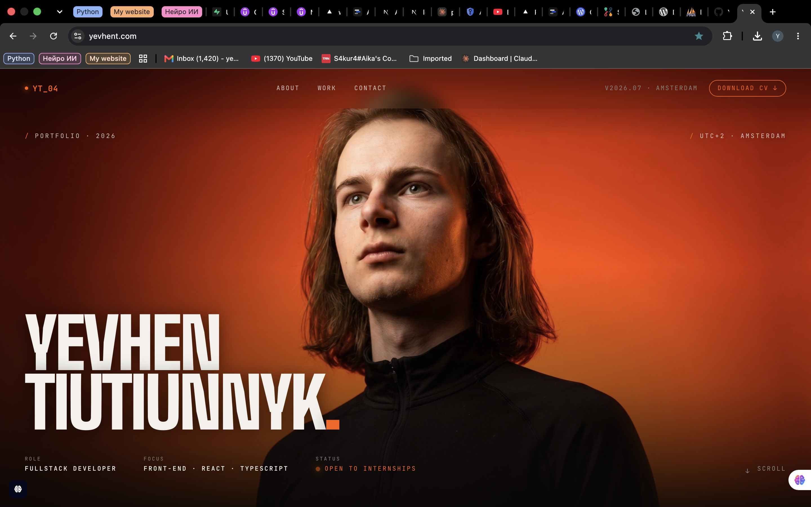

# Yevhen Portfolio — WordPress theme

My portfolio ([yevhent.com](https://yevhent.com)) rebuilt as a **custom classic
WordPress theme**, one lesson at a time, for the WordPress module of the Software
Development course at Mediacollege Amsterdam. It is a learning project and is
**still in progress**.



## What's in it

- **Classic theme, no page builder.** Hand-written templates (`header.php`,
  `footer.php`, `front-page.php`, `page.php`, `page-contact.php`, `index.php`)
  that follow the WordPress template hierarchy.
- **Dynamic content.** The About text comes from the front page itself through
  The Loop. Pages show their featured image (`post-thumbnails`), and the
  "Selected Work" cards are rendered from a PHP array in `functions.php`.
- **Enqueued assets.** CSS and JS are loaded with `wp_enqueue_style` /
  `wp_enqueue_script`, using the theme version for cache busting.
- **Sass + Webpack build** with Bootstrap 5. It outputs both a readable and a
  minified bundle to `dist/`.
- **Contact form**, written by hand without a form plugin:
  - nonce check (`wp_nonce_field` / `wp_verify_nonce`)
  - input sanitising (`sanitize_text_field`, `sanitize_email`, …) and
    server-side validation with error messages in Dutch
  - spam check against the **Akismet** API. If the plugin isn't active or has no
    key, the check is skipped instead of blocking everyone.
  - output escaping (`esc_attr`, `esc_html`, `esc_textarea`) when the form is
    re-rendered
  - mail sent with `wp_mail`, then redirect after POST so a refresh doesn't
    resend
- **Local mail testing.** `phpmailer_init` routes all mail to Mailpit, so no real
  email leaves the machine.

## Stack

WordPress · PHP · Sass · Bootstrap 5 · Webpack · Docker (WordPress, MariaDB,
phpMyAdmin, Mailpit)

## Run it locally

You need Docker and, if you want to rebuild the styles, Node.js.

```bash
cp .env.example .env        # pick your own local passwords
docker compose up -d
```

| Service    | URL                                            |
| ---------- | ---------------------------------------------- |
| WordPress  | http://localhost                               |
| Mailpit    | http://localhost:8025 (catches sent mail)      |
| phpMyAdmin | http://localhost:1089                          |

Then, in WordPress:

1. Finish the install wizard and activate the theme **Yevhen Portfolio**.
2. Set a static front page under *Settings → Reading*. Its content becomes the
   About text.
3. Create a page with the slug `contact`. WordPress picks `page-contact.php` for
   it automatically.
4. *(Optional)* Activate Akismet and enter an API key to turn on the spam check.

### Rebuilding the theme assets

The built files in `dist/` are committed, so this is only needed after changing
the Sass or JS.

```bash
cd themes/my-portfolio
npm install
npm run prod      # or: npm run watch while working
```

## Project layout

```
docker-compose.yml         WordPress + MariaDB + phpMyAdmin + Mailpit
themes/my-portfolio/
  style.css                theme header (name, version)
  functions.php            theme setup, enqueueing, mail config, Akismet check
  front-page.php           hero, About (The Loop), Selected Work
  page.php / index.php     generic page / fallback templates
  page-contact.php         contact form: nonce, sanitising, validation, Akismet
  src/scss/                Sass sources (variables, theme, contact)
  dist/                    compiled CSS/JS (Webpack)
  ai-log.md, prompt.md     per-lesson logs kept for the course
plugins/                   Akismet
```

## Progress by lesson

| Lesson | Topic |
| ------ | ----- |
| 1 | Docker setup, first version of the theme, activated in WordPress |
| 2 | Reworking the starting point into my own code and structure |
| 3 | Templates, enqueueing and the template hierarchy |
| 4 | The Loop with featured images and dynamic content |
| 5 | Sass, npm and Webpack with Bootstrap |
| 6 | Custom contact form with Akismet |

## Still to do

- Move the projects out of a hard-coded array into a custom post type, so they
  can be edited in the admin.
- Fill `src/js/main.js`. It is empty for now.
